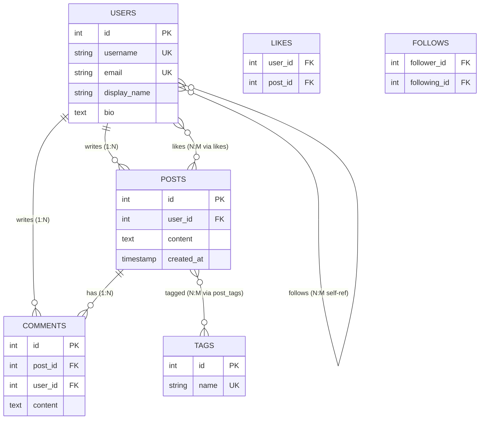

# Data Modeling

📖 **Source**: [Hello Interview – Data Modeling for System Design Interviews](https://www.hellointerview.com/learn/system-design/core-concepts/data-modeling)

## Overview

Data modeling is the process of defining how your application's data is structured, stored, and related. In practice, this means deciding what **entities** exist, how they're **identified**, and how they **connect** to one another.

A sloppy data model leads to painful issues later — bad performance, inconsistent data, and designs that fall apart at scale. A solid, "good enough" model lets the rest of your system stay simple. This lab walks you through the fundamentals with a real social media schema you can query and experiment with.

> 🧭 **Guiding principle:** *Access patterns drive the schema.* Before designing tables, list the reads and writes your app needs (e.g. "show a user's feed", "count likes on a post"). Then choose entities, relationships, and indexes that make those operations fast.

## 🗺️ The Schema At a Glance



## Notebooks in This Series

| # | Notebook | What You'll Learn |
|---|----------|-------------------|
| 1 | Relational Modeling Basics | Entities, keys, relationships, constraints, and basic SQL queries |
| 2 | Denormalization Trade-offs | When and why to denormalize, measuring the performance impact |
| 3 | NoSQL Data Models | Document, key-value, and wide-column patterns (simulated with PostgreSQL JSON) |
| 4 | Schema Evolution | Adding columns, changing types, migrations, and backward compatibility |

## Prerequisites

- Python 3.10+
- Docker & Docker Compose
- Basic understanding of SQL

## Quick Start

```bash
# Navigate to the lab directory
cd 01-foundations/data-modeling

# Start PostgreSQL + Adminer
docker-compose up -d

# Install dependencies
uv sync

# Register Jupyter kernel
uv run python -m ipykernel install --user --name=data-modeling --display-name="Data Modeling (Python)"

# Open the first notebook and start learning!
```

## 🔍 Visualization Tools (Included in Docker)

### Adminer (PostgreSQL GUI)
- **URL**: http://localhost:8080
- **Login**: System `PostgreSQL`, Server `postgres`, Username `demo`, Password `demo`, Database `data_modeling_demo`
- **Use for**: Explore tables, run queries, see relationships between data

## Key Concepts Covered

### Database Model Options
- **Relational (SQL)** — tables with fixed schemas, foreign keys, ACID guarantees *(default choice)*
- **Document (MongoDB)** — flexible JSON-like documents, good for evolving schemas
- **Key-Value (Redis)** — simple lookups by key, great for caching
- **Wide-Column (Cassandra)** — optimized for massive write-heavy workloads
- **Graph (Neo4j)** — nodes and edges for relationship-heavy data *(rarely needed)*

### Schema Design Fundamentals
- **Entities, Keys & Relationships** — primary keys, foreign keys, 1:N and N:M relationships
- **Normalization** — store each fact once, avoid data anomalies
- **Denormalization** — duplicate data strategically for read performance
- **Indexing** — speed up queries by creating indexes on frequently queried columns
- **Sharding** — split data across machines when it outgrows one database

### Core Advice
> Most of the time, the right answer is a **relational database**. It's the default unless your requirements clearly signal a specialized model. Start normalized, denormalize only when you have a reason.

## Real-World Examples

| System | Data Modeling Challenge |
|--------|----------------------|
| Twitter | User→Posts (1:N), Follows (N:M self-ref), denormalized timelines |
| Amazon | Products, Orders, Payments — strong consistency for transactions |
| Instagram | Posts with embedded media metadata, like counts denormalized |
| Uber | Rides connecting riders and drivers, real-time location data |

## License

Educational content — feel free to use and modify for learning purposes.
